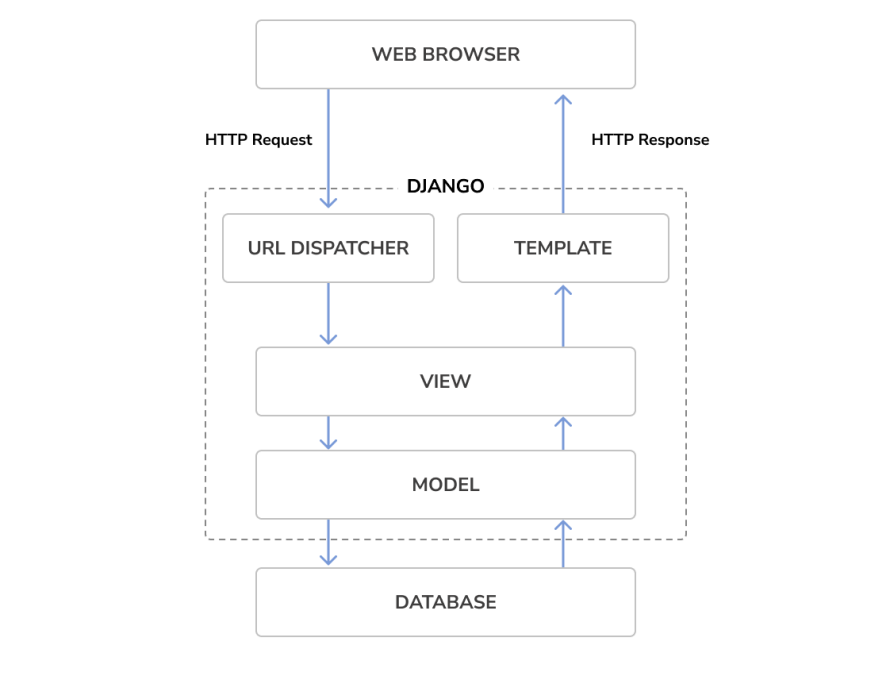

<h1 align='center'>👉 Hello World App 👈</h1>

## 1. Initial Set Up

## 2. HTTP Request/Response cycle
#### 👉 note: from django 4 by examples book (he explain it better, just my opinion)


1. A web browser requests a page by its URL and the web server passes the HTTP request to Django.
2. Django runs through its configured URL patterns and stops at the first one that matches the requested URL.
3. Django executes the view that corresponds to the matched URL pattern.
4. The view potentially uses data models to retrieve information from the database.
5. Data models provide the data definition and behaviors. They are used to query the database.
6. The view renders a template (usually HTML) to display the data and returns it with an HTTP response.

## 3. MVC vs MVT(django)
#### 1. MVC: Model-View-Controller
- **Model:** Manages data and core business logic.
- **View:** Renders data from the model in a particular format.
- **Controller:** Accepts user input and performs application-specific logic.

#### 2. MVT: Model-View-Template or Model-View-Template-URl
- **Model:** Manages data and core business logic.
- **View:** Describes which data is sent to the user but not its presentation.
- **Template:** Presents the data as HTML with optional CSS, JavaScript, and Static Assets.
- **URL Configuration:** Regular-expression components configured to a View.

### HTTP Request -> URL -> View -> Model and Template -> HTTP Response

## 4. create the app:
1. start the app : `python manage.py startapp pages`
2. add it to the settings: 
    ```
    # project/settings.py
    INSTALLED_APPS = [
        ....
        #my apps
        "pages.apps.PagesConfig",
    ]
    ```
3. hello world view:
    ```
    # pages/views.py
    from django.http import HttpResponse

    def homePageView(request):
        return HttpResponse("Hello World")
    ```
4. hello world url:
    ```
    # pages/urls.py
    from django.urls import path
    from .views import homePageView
    urlpatterns = [
        path('', homePageView, name="home")
    ]
    ```
5. adding the url to the project:
    ```
    # project/urls.py
    from django.contrib import admin
    from django.urls import path, include # new
    urlpatterns = [
        path("admin/", admin.site.urls),
        path("", include("pages.urls")), # new
    ]
    ```
6. run the server: `python manage.py runserver`

## 5. requirements & gitignore : 
- `pip freeze > requirements.txt`
- `echo .venv/ > .gitignore`


## 6. git & github
1. create repository on github
2. add the files to the repository: `git add .`
3. commit the changes: `git commit -m "first commit"`
4. connect it to the remote link : `git remote add origin link.git`
5. change the name of the branch : `git branch -M main`
6. upload the changes to the remote link: `git push -u origin main`

<br>
<br>

<h2 align="center"> :smile: Done :smile: </h2>